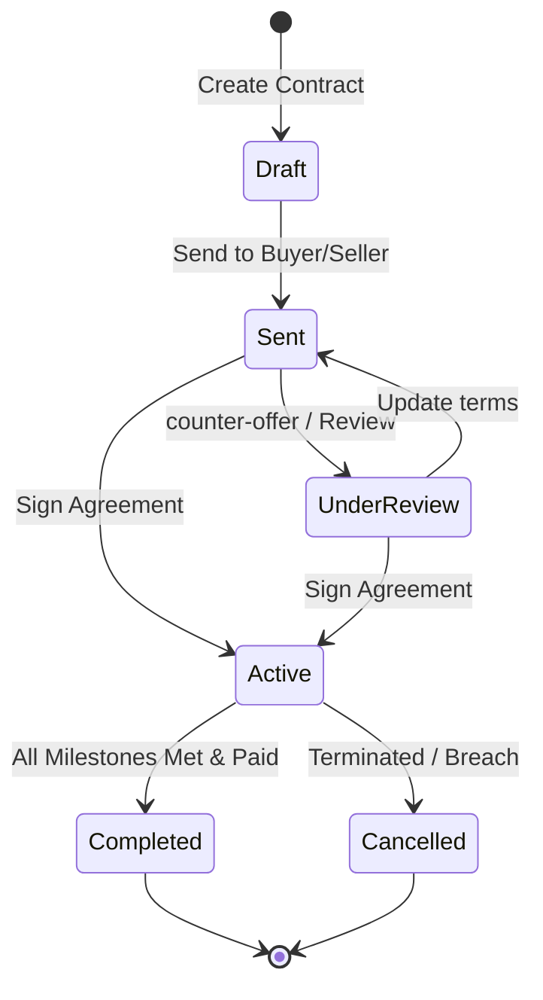

# Backend Plan: Contract Farming System

This document outlines the database schema, API endpoints, state machine, and compliance tracking logic required to support the contract farming workflow in the KilimoAI platform.

## 1. Database Schema

The database architecture uses PostgreSQL. Three main tables handle agreements, milestones, and compliance.

```sql
-- Represents a contract agreement between a Buyer (e.g., agribusiness, exporter) and a Seller (Farmer or Cooperative).
CREATE TABLE public.contracts (
    id UUID PRIMARY KEY DEFAULT gen_random_uuid(),
    title VARCHAR(255) NOT NULL,
    buyer_id UUID REFERENCES auth.users(id) ON DELETE RESTRICT,
    seller_id UUID REFERENCES auth.users(id) ON DELETE RESTRICT,
    crop VARCHAR(100) NOT NULL,
    quantity_kg NUMERIC(12, 2) NOT NULL CHECK (quantity_kg > 0),
    price_per_kg_tzs NUMERIC(10, 2) NOT NULL CHECK (price_per_kg_tzs > 0),
    region VARCHAR(100) NOT NULL,
    status VARCHAR(50) NOT NULL DEFAULT 'draft' CHECK (status IN ('draft', 'sent', 'under_review', 'active', 'completed', 'cancelled')),
    signed_at TIMESTAMP WITH TIME ZONE,
    created_at TIMESTAMP WITH TIME ZONE DEFAULT timezone('utc'::text, now()) NOT NULL,
    updated_at TIMESTAMP WITH TIME ZONE DEFAULT timezone('utc'::text, now()) NOT NULL
);

-- Represents specific milestones or deliverables (e.g., planting confirmation, first weeding, harvesting, delivery) linked to payment releases.
CREATE TABLE public.contract_milestones (
    id UUID PRIMARY KEY DEFAULT gen_random_uuid(),
    contract_id UUID REFERENCES public.contracts(id) ON DELETE CASCADE,
    title VARCHAR(255) NOT NULL,
    description TEXT,
    due_date DATE NOT NULL,
    amount_tzs NUMERIC(12, 2) NOT NULL CHECK (amount_tzs >= 0),
    status VARCHAR(50) NOT NULL DEFAULT 'pending' CHECK (status IN ('pending', 'under_review', 'completed', 'failed')),
    paid BOOLEAN NOT NULL DEFAULT FALSE,
    paid_at TIMESTAMP WITH TIME ZONE,
    created_at TIMESTAMP WITH TIME ZONE DEFAULT timezone('utc'::text, now()) NOT NULL
);

-- Tracking system for soil quality, pesticide use, and farming guidelines compliance.
CREATE TABLE public.contract_compliance (
    id UUID PRIMARY KEY DEFAULT gen_random_uuid(),
    contract_id UUID REFERENCES public.contracts(id) ON DELETE CASCADE,
    metric_type VARCHAR(100) NOT NULL CHECK (metric_type IN ('pesticide_limit', 'soil_ph', 'moisture_level', 'seed_quality')),
    required_value VARCHAR(255) NOT NULL,
    actual_value VARCHAR(255),
    status VARCHAR(50) NOT NULL DEFAULT 'pending' CHECK (status IN ('pending', 'passed', 'failed')),
    checked_at TIMESTAMP WITH TIME ZONE,
    notes TEXT
);
```

---

## 2. API Endpoints

### Contracts Management
* `GET /api/contracts` - List all contracts for the current authenticated user (returns contracts where user is buyer or seller).
* `POST /api/contracts` - Create a new contract agreement.
* `GET /api/contracts/:id` - Fetch contract details, including milestones and compliance metrics.
* `PATCH /api/contracts/:id/status` - Transition contract status (e.g., from `draft` to `sent`).
* `POST /api/contracts/:id/sign` - Sign a contract. Updates status to `active` and records signature timestamp.

### Milestones & Payments
* `POST /api/contracts/:id/milestones/:milestoneId/submit` - Farmer submits proof of milestone completion. Status becomes `under_review`.
* `POST /api/contracts/:id/milestones/:milestoneId/approve` - Buyer approves milestone and triggers payment webhook. Status becomes `completed`.
* `POST /api/contracts/:id/milestones/:milestoneId/payout` - Callback endpoint from mobile money provider (M-Pesa/Tigo Pesa) confirming disbursement. Sets `paid = true` and `paid_at`.

---

## 3. Contract State Machine



### Transition Triggers:
1. **draft -> sent**: Owner submits contract proposal.
2. **sent -> under_review**: Counterparty opens contract and begins validation checks.
3. **under_review / sent -> active**: Both parties append digital signature keys.
4. **active -> completed**: Cron checker confirms all `contract_milestones` are `status = 'completed'` and `paid = true`.
5. **active -> cancelled**: Buyer or Seller manually triggers cancelation (requires mediation state), or a compliance check fails critical thresholds.

---

## 4. Compliance Tracking & Audit Logic

A background function evaluates sensor/ledger inputs against `contract_compliance` thresholds every 24 hours:

1. **Soil pH Verification**: Reads soil analysis telemetry in target fields. If pH drifts outside the contractual range (e.g., `< 5.5` or `> 7.5`), it triggers a `contract_compliance` status update to `failed` and alerts both parties.
2. **Delivery Weights Verification**: When crops are weighed at collection stations, scales upload weights via API. If weight matches the contract target, compliance is marked `passed`.
